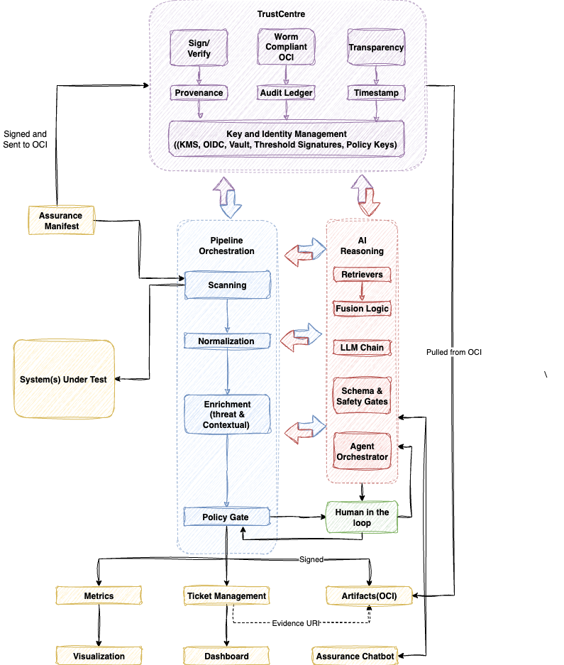

# Certus TAP

**Certus Trust & Assurance Platform (CertusTAP)**  aims to be a unified open framework for evaluating, enriching, and governing software and AI systems through automation, evidence, and selective human review.  We want to create a language of assurance that both humans and systems can use to underscore trust.

At the moment the goal is to use this platform to combine Security, Integrity, Privacy, and AI Assurance testing into a single automated flow. It ensures every artifact, whether code, container, dataset, or model, is scanned, normalized, enriched with context and threat data, evaluated by policy, and stored as immutable evidence in a locked down OCI repository.  The architecture is designed for immutability, traceability, and human-in-the-loop (HITL) oversight where judgment is required.

??? info "Click to view Architecture"

    { .static-diagram }

Ultimately, some of the use cases we hope to tackle with this approach include but are not limited to:

* **Prove software integrity** through automated build attestations and signed provenance.
* **Continuously validate security posture** with embedded scanning and evidence collection.
* **Detect and mitigate privacy risks** using automated PII and data-handling analysis.
* **Govern AI behavior** via bias, fairness, and transparency evaluations built into the workflow.
* **Map controls to frameworks** (SOC 2, NIST, ISO, AI Act) to generate machine-readable compliance evidence.
* **Enable selective human review** where ethical or contextual judgment is required.
* **Maintain a living evidence trail** linking code, model, and policy decisions to measurable proof.
* **Unify assurance language across humans and systems** through standardized metadata and schemas.
* **Provide the data, metrics, and integrations** for organizations preferred compliance tooling to generate real-time trust dashboards summarizing compliance, risk, and integrity metrics.
* **Facilitate continuous audit readiness** by automating evidence generation and storage.
* **Support secure supply-chain validation** with verifiable SBOMs and dependency attestations.
* **Bridge development and governance** so assurance is built in—not bolted on.
* **Empower external stakeholders** (regulators, customers, partners) with transparent, verifiable trust artifacts.
* **Drive accountability** by codifying human decisions and approvals into the assurance record.
* **Foster ecosystem collaboration**  through open, machine-interpretable assurance specifications.

---