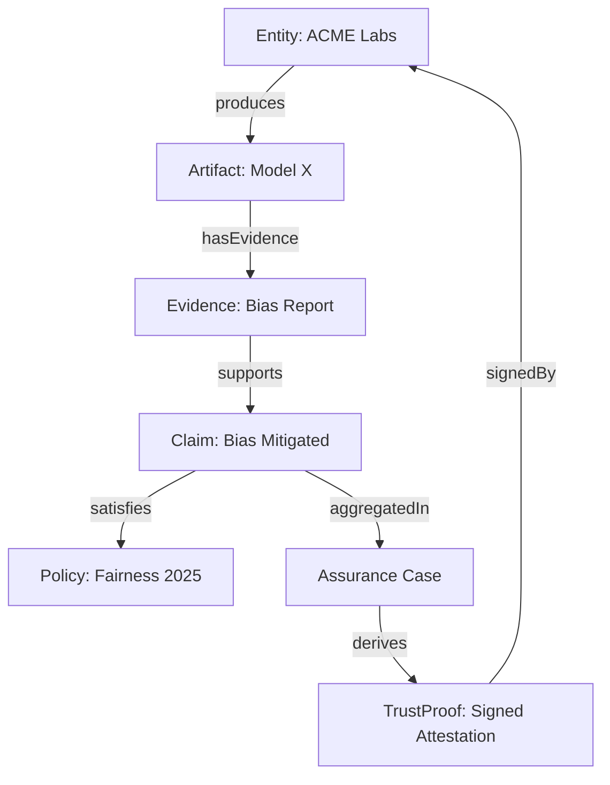

# Certus TAO

Trust & Assurance Ontology (TAO)
**Version:** 0.1  
**Last Updated:** 2025-10-16  
**Source:** [tao-ontology.ttl](tao-ontology.ttl)  
**Namespace:** `https://certus.tap/ontology/tao#`  

---

## Overview
The **Trust & Assurance Ontology (TAO)** provides a semantic framework for describing, linking, and reasoning about trust, assurance, provenance, and evidence across AI and security systems.  It integrates principles from **W3C PROV-O**, **ISO/IEC 15026 (Assurance Cases)**, and **NIST OSCAL** to support interoperable assurance pipelines.

---

## Core Classes

| Class | Description | Example |
|-------|--------------|----------|
| **Entity** | Actor or agent participating in assurance activities. | `ACME Labs`, `Auditor` |
| **Artifact** | Produced object under evaluation or assurance. | `AI Model`, `Dataset`, `Source Code` |
| **Evidence** | Proof supporting a claim or requirement. | `Bias Report`, `Pen Test`, `Policy Evaluation` |
| **Claim** | Statement requiring supporting evidence. | “Model is bias-tested.” |
| **Policy** | Normative rule or standard requirement. | `FairnessPolicy2025`, `ISO27001 A.12.4` |
| **Control** | Atomic implementation of a policy requirement. | `NIST AC-2`, `SOC2 Security Principle` |
| **Evaluation** | Assessment activity or metric result. | `DeepEval Run`, `CVSS Scan`, `Fairness Check` |
| **AssuranceCase** | Structured argument linking claims and evidence. | “Bias mitigation verified for Model X.” |
| **TrustProof** | Verifiable summary or attestation derived from an assurance case. | `Cosign Attestation`, `Signed Waiver` |
| **Attestation** | Signed cryptographic proof asserting compliance. | `SLSA Provenance Attestation` |
| **Risk** | Identified concern with impact and mitigation. | `Model Bias`, `Unverified Signature` |
| **Signature** | Digital signature binding an entity to an artifact. | `Cosign Keyless Signature` |
| **Timestamp** | Cryptographic timestamp (e.g., RFC 3161). | `TSA Token` |
| **AuditEvent** | Logged event relevant to trust or governance. | `Model Validation Logged` |

---

## Relationships

| Relationship | Domain → Range | Description |
|---------------|----------------|--------------|
| `produces` | Entity → Artifact | Entity produces an artifact under assurance. |
| `generatedBy` | Artifact → Activity | Artifact generated by a process or build. |
| `hasEvidence` | Artifact → Evidence | Artifact is supported by assurance evidence. |
| `supportsClaim` | Evidence → Claim | Evidence backs up a claim. |
| `satisfiesPolicy` | Claim → Policy | Claim fulfills a policy or control. |
| `validates` | Evaluation → Evidence | Evaluation confirms or tests evidence. |
| `aggregates` | AssuranceCase → Claim | Assurance case bundles multiple claims. |
| `derivesFrom` | TrustProof → AssuranceCase | Trust proof is derived from an assurance case. |
| `impacts` | Risk → Artifact | Risk affects an artifact. |
| `mitigates` | Control → Risk | Control reduces risk likelihood or impact. |
| `signedBy` | TrustProof → Entity | Proof is signed by an entity. |
| `hasProvenance` | Artifact → Entity | Provenance link to source or origin. |
| `referencesArtifact` | Evidence → Artifact | Evidence refers to specific artifact. |
| `hasMetric` | Evaluation → Document | Evaluation produces a measurable result. |
| `aboutArtifact` | AssuranceCase → Artifact | Assurance case concerns specific artifact. |
| `hasSignature` | TrustProof → Signature | Trust proof includes a digital signature. |
| `hasTimestamp` | TrustProof → Timestamp | Trust proof includes a timestamp. |

---

## Data Properties

| Property | Applies To | Description |
|-----------|-------------|-------------|
| `hasHash` | Artifact | Hash value (e.g., SHA256) of the artifact. |
| `hasDigestAlgorithm` | Artifact | Algorithm used for hashing (e.g., SHA256). |
| `hasURI` | Artifact | Canonical storage or OCI URI. |
| `createdAt` | Entity/Artifact | Creation timestamp. |
| `updatedAt` | Entity/Artifact | Last update timestamp. |
| `scoreValue` | Evaluation | Numeric score (e.g., 0.94). |
| `scoreType` | Evaluation | Metric type (`CVSS`, `DeepEval.Fairness`). |
| `severity` | Risk | Severity descriptor (e.g., `High`, `Medium`). |
| `status` | Risk | Status of the risk (`Open`, `Mitigated`). |

---

## Concept Map



---

## Example Individuals

```turtle
:ModelX a tao:Model ;
  tao:hasURI "oci://trustcentre/org/product/modelx@sha256:abcd..." ;
  tao:hasHash "abcd..." ;
  tao:hasDigestAlgorithm "sha256" ;
  tao:hasEvidence :BiasReport1 .

:BiasReport1 a tao:Evidence ;
  tao:referencesArtifact :ModelX ;
  tao:supportsClaim :ClaimBiasMitigated .

:ClaimBiasMitigated a tao:Claim ;
  tao:satisfiesPolicy :FairnessPolicy2025 .

:FairnessPolicy2025 a tao:Policy ;
  rdfs:label "Fairness Policy 2025"@en .
```

---

## External Mappings

| External Standard | TAO Alignment | Example |
|--------------------|----------------|----------|
| **W3C PROV-O** | Provenance tracking for entities, artifacts, activities | `prov:Entity`, `prov:Activity` |
| **ISO/IEC 15026** | Assurance case structures | `AssuranceCase`, `Claim`, `Evidence` |
| **NIST OSCAL** | Compliance and control linkage | `Policy`, `Control`, `Risk` |
| **AI Model Cards / Datasheets** | Ethical & performance evidence | `Evidence`, `Evaluation`, `Metric` |
| **COSIGN / SLSA / Rekor** | Signed provenance and attestations | `TrustProof`, `Signature`, `Timestamp` |

---

## Governance Notes

- The ontology is designed to be **extendable** and **alignable** with domain-specific ontologies (e.g., Privacy, Safety, Fairness).  
- **Versioning** should follow semantic versioning (e.g., `0.1`, `0.2`, `1.0`).  
- **Namespace convention:** `https://certus.tap/ontology/tao#`  
- **Storage recommendation:** Publish both `.ttl` and `.jsonld` versions in an open, queryable location (e.g., GitHub Pages or OCI registry).

---

## Future Extensions

| Area | Planned Additions |
|------|-------------------|
| **AI Ethics** | Bias, transparency, and accountability classes |
| **Security** | Zero Trust entity interactions, signature validation axioms |
| **Privacy** | PII detection evidence (Presidio integration) |
| **Governance** | Policy lineage, review records, and auditor roles |

---

**Author:** TAO Working Draft  
**Maintainer:** Martin Harrod  
**License:** Creative Commons Attribution 4.0 International (CC-BY 4.0)  
